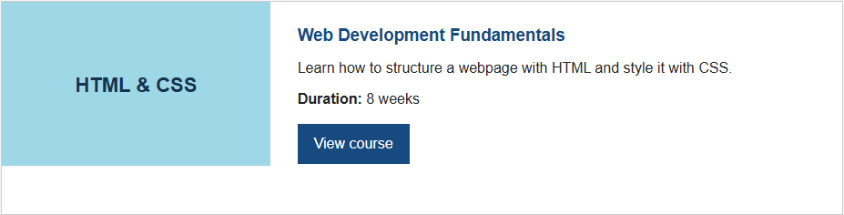
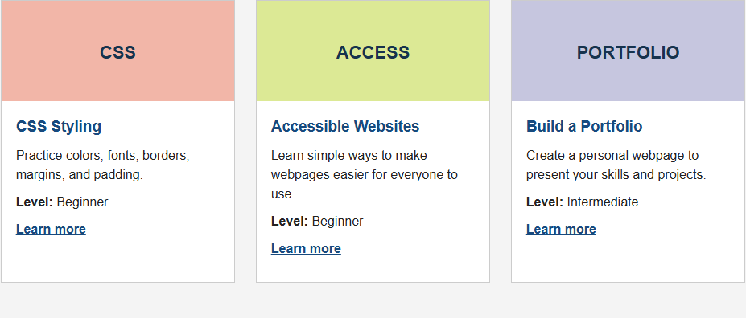
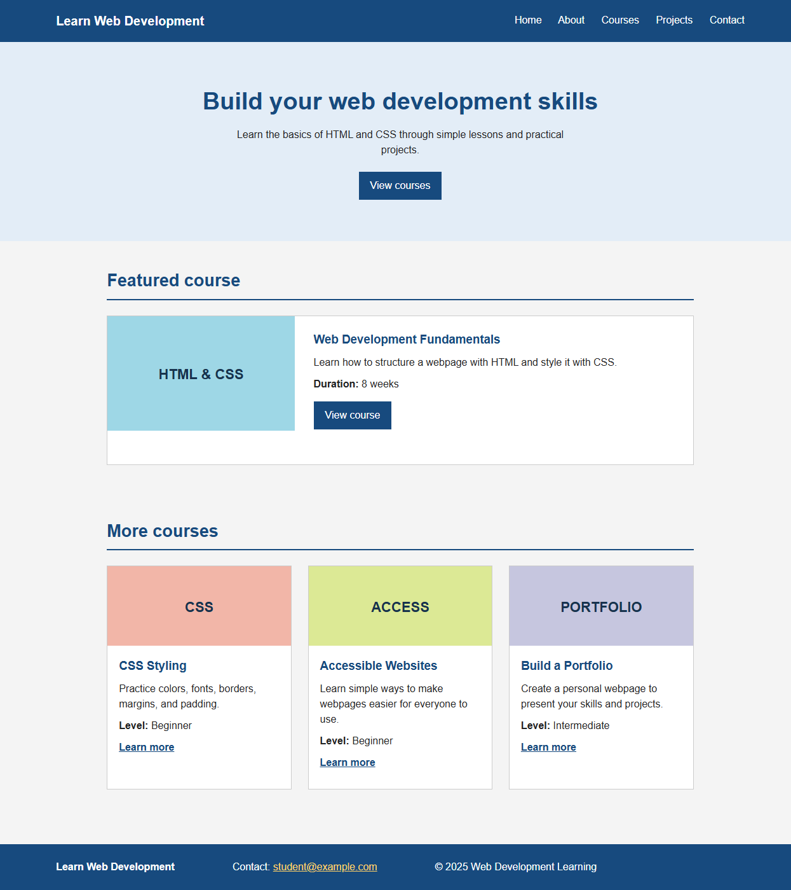

# Field Notes — HTML & CSS Practical Assignment

## Student Information

- **Student Name:** Simon KC
- **Student ID:** 2602412472
- **Module Name:** Fundamentals of Software Engineering
- **Assignment Title:** HTML and CSS Assignment

## Project Description

This project is a basic course website for people learning web development. It combines a navigation bar, an introduction, a featured course card, three supporting cards, and a footer into one complete webpage.

The design uses straightforward HTML and CSS with a blue and white color scheme, simple card borders, and clear text. The colored card panels act as simple placeholders for course images.

## Technologies Used

- HTML5
- CSS3

No Flexbox, CSS Grid, Bootstrap, or Tailwind CSS was used. The layouts use normal document flow, inline-block, floats, margins, padding, borders, and media queries.

## Learning Resources

| No. | Resource | Topic learned | What I learned | How I used it |
| --- | --- | --- | --- | --- |
| 1 | Teacher's material | CSS selectors | Element, class, pseudo-class, and descendant selectors can target different parts of a page. | I used selectors such as `.course-card`, `.site-nav a:hover`, and `.featured-content h3` to style related elements consistently. |
| 2 | University material | HTML structure | Semantic elements communicate the purpose of page regions. | I used `header`, `nav`, `main`, `section`, `article`, and `footer` instead of using only generic `div` elements. |
| 3 | [MDN: CSS box model](https://developer.mozilla.org/en-US/docs/Learn/CSS/Building_blocks/The_box_model) | Margin, border, and padding | Padding creates space inside a border, while margin creates space outside it. | I used padding for readable card content and margins to separate the hero, sections, and cards. |
| 4 | [MDN: CSS display](https://developer.mozilla.org/en-US/docs/Web/CSS/display) | Inline-block layout | Inline-block elements can sit beside one another while keeping width and height. | I used inline-block for the featured card columns and the three-card row instead of Grid or Flexbox. |
| 5 | [MDN: `:hover`](https://developer.mozilla.org/en-US/docs/Web/CSS/:hover) | Interaction states | A hover selector changes an element's appearance when the pointer is over it. | I added hover states to navigation links, the main button, and course links. |

## Screenshots

Add the four browser screenshots to the `screenshots` folder after running the page:

### Navigation Bar

### Single Card

### Multiple Cards

### Complete Website

## What I Learned

- How to structure a page with semantic HTML5 elements.
- How class, descendant, and pseudo-class selectors work together.
- How color, typography, text alignment, and spacing create a visual hierarchy.
- How image-like visual panels can be created with CSS background colors and text.
- How margin, padding, borders, and border radius affect the CSS box model.
- How hover effects provide feedback for links and buttons.
- How inline-block and normal flow can arrange cards without Flexbox or Grid.
- How a media query can make a layout usable on a smaller screen.

## Challenges and Solutions

**Challenge 1: Arranging multiple cards without Flexbox or Grid.**  
I used `display: inline-block`, percentage widths, and `vertical-align: top`. I also added a clearfix-style pseudo-element to justify the spacing between the cards.

**Challenge 2: Keeping the featured card readable while giving its artwork a strong visual identity.**  
I separated the visual panel from the content panel and used a limited palette. This keeps the title and description readable while making the card feel like part of the Field Notes brand.

**Challenge 3: Making the navigation and cards usable on smaller screens.**  
I added a media query that moves navigation links onto their own line and changes each card to full width.

## AI Usage

I used Microsoft Copilot as a learning assistant to check the HTML structure and CSS requirements. I learned how to organize the required sections and style cards with basic CSS. I reviewed and adjusted the final content, layout, colors, and CSS implementation myself, and I am responsible for understanding the finished code.
